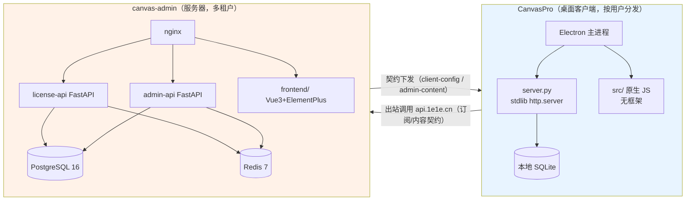

# canvas-admin 完整合并进 CanvasPro 可行性架构评审报告

> 评审对象：将 `F:\canvas-admin`（独立管理后台 + 授权服务）**完整合并**进 `F:\CanvasPro`（Electron 桌面客户端）。
> 评审方式：以**实地勘察的一手事实**（文件、配置、路由、测试、部署脚本）为依据，不做泛化推断。
> 评审结论分级：**可做 / 有保留可做 / 不建议 / 不可做**。
> 报告日期：按勘察快照（canvas-admin 最后改动 2026-10-10）。

---

## 0. 执行摘要（TL;DR）

| 问题 | 结论 |
| --- | --- |
| 完全合并（admin 后端 + 前端 + 部署整体搬进 CanvasPro）是否可行？ | **技术上有保留可做，但强烈不建议。** 这是把「服务端多租户 SaaS」塞进「按用户分发的桌面安装包」，方向性错误。 |
| 根本矛盾是什么？ | CanvasPro 是**分发到每个用户机器上的客户端**；canvas-admin 是**运行在一台服务器上的多租户后端**。二者的运行时形态、数据边界、信任边界、部署形态完全不同。 |
| 与既有决策是否冲突？ | **直接冲突。** canvas-admin 设计文档 §8/§12 与《交接说明》均明确「独立新仓库」，且记录「曾讨论过放客户端子目录，已否决（用户最终拍板）」。当前合并诉求推翻该已落决策。 |
| 推荐方案 | **方案 C 为主：不物理合并，做「契约对齐 + 联动发布 + 单仓视图（独立保留构建/部署）」。** 若必须单仓管理，退而求其次选 **方案 B 目录级 monorepo**（admin 保留独立构建与独立部署）。**方案 A（全量单仓并入 CanvasPro 安装包）应否决。** |
| 一句话给用户 | 想要的是「单仓管理 / 统一发版 / 降运维」——这三类动机有**比物理合并更好的达成方式**（详见 §4、§6）。物理合并不会让它更好用，只会让发布链更脆、攻击面更大、安装包更臃肿。 |

---

## 1. 三方对比表（CanvasPro vs canvas-admin）

> 说明：下表逐维度对比两者。**同构** = 可直接复用；**异构** = 概念对应但实现不同；**冲突** = 合并会产生硬性矛盾。

### 1.1 结构与形态

| 维度 | `F:\CanvasPro`（合并目标） | `F:\canvas-admin`（合并源） | 判定 |
| --- | --- | --- | --- |
| 产品定位 | 桌面客户端（编辑器），**按用户分发** | 服务端管理后台 + 授权服务，**单机部署在服务器** | **冲突** |
| 仓库形态 | 独立仓库（`luseaer-ship-it/CanvasPro`），**已用于 GitHub Releases 分发** | 独立仓库（`luseaer-ship-it/canvas-admin`，私有，已推 main） | **冲突**（双发布源） |
| 顶层目录 | `api/ assets/ backend/ db/ electron/ images/ native/ src/ styles/ vendor/ index.html style.css main.js server.py requirements.txt` | `backend/ frontend/ deploy/ docs/` | **异构** |
| 后端目录 | `backend/`（`services/` ≈50 个 service + 同名 test，`shortdrama_*.py`，`db/`） | `backend/app/`（`api/ core/ services/ legal/ models/`，`alembic/`） | **异构**（同名 `backend/` 但内部结构完全不同） |
| 前端目录 | `src/`（原生 JS 模块：components/core/domain/hooks/modules/services/ui/utils），**无框架** | `frontend/src/`（Vue3 SFC，14 个 `views/*.vue`） | **冲突**（框架范式不同） |
| 代码规模 | server.py 3875 行；backend/services ≈50 service | app/ 6802 行 + tests/ 2918 行 + frontend/src 3949 行 | **异构** |

### 1.2 技术栈

| 维度 | CanvasPro | canvas-admin | 判定 |
| --- | --- | --- | --- |
| 后端框架 | **Python 标准库 `http.server` + 自研 `HttpRouteDispatcher`**（手写路由） | **FastAPI + Uvicorn** | **冲突**（两套 Web 栈） |
| ORM / 迁移 | 无 ORM；`knex`（仅 Node 侧 migrate）；短剧用独立 SQLite schema | **SQLAlchemy 2.x + Alembic**（7 个迁移版本） | **冲突** |
| 数据库 | **本地 SQLite**（随客户端） | **PostgreSQL 16**（多租户） + Redis 7 | **冲突**（数据边界根本不同） |
| 缓存/限流 | 无 | **Redis 7 共享 Lua 滑动窗口限流** | **冲突** |
| 认证 | 内置授权客户端（HMAC 签名 + 离线缓存校验） | **PyJWT + 会话 + MFA + CSRF + RBAC** | **异构**（客户端是消费方，后台是签发方） |
| 加密 | hashlib/hmac（stdlib） | **cryptography**（AES-256-GCM / CDKEY 可恢复密文） | **异构** |
| HTTP 客户端 | `requests` | **httpx**（异步） | **异构** |
| 前端框架 | **无框架**（原生 JS 模块 + `index.html`/`style.css`） | **Vue 3.5 + Element Plus 2.9 + Vite 6** | **冲突** |
| 后端依赖清单 | `requirements.txt`：requests / pillow / scenedetect / opencv-python / defusedxml / pypdf（**6 项，极简**） | `requirements.txt`：fastapi / uvicorn / sqlalchemy / pydantic-settings / pyjwt / alembic / psycopg2-binary / redis / httpx / cryptography / pytest（**11 项，重**） | **冲突** |

### 1.3 构建方式

| 维度 | CanvasPro | canvas-admin | 判定 |
| --- | --- | --- | --- |
| 前端构建 | **无构建**（源码即产物，原生 ESM 直载） | **Vite 6 build**（含 `manualChunks` 分包） | **冲突** |
| 打包工具 | **electron-builder**（`electron-builder.win.cjs`），nsis + zip，`files:` **白名单** | 无 electron；用 **Dockerfile + Docker Compose** 构建镜像 | **冲突** |
| 运行时依赖 | `extraResources: .electron-runtime/runtime`（**自带 Python 运行时**） | 容器内 Python 3.12 镜像 | **冲突** |
| CI | `.github/workflows/ci.yml`，**windows-latest**；`npm test` 四道闸门 | 未见独立 CI（测试靠本地 pytest；部署走 `deploy/deploy.sh`） | **异构** |

### 1.4 运行时形态

| 维度 | CanvasPro | canvas-admin | 判定 |
| --- | --- | --- | --- |
| 运行位置 | **用户机器**（Electron 内起本地 Python 服务，`server.py`） | **服务器 14.103.49.35**（容器栈） | **冲突** |
| 进程模型 | Electron 主进程 + 本地 Python 子进程（单用户） | 多容器：nginx + license-api + admin-api + postgres + redis（多租户） | **冲突** |
| 网络面 | 客户端**出站**调用 `https://api.1e1e.cn` | **入站**被公网访问（`api.1e1e.cn` / `canvas.1e1e.cn`） | **冲突** |
| 数据归属 | 用户本地数据（SQLite / user-data） | 集中式多租户数据（Postgres，所有用户） | **冲突** |

### 1.5 部署形态

| 维度 | CanvasPro | canvas-admin | 判定 |
| --- | --- | --- | --- |
| 部署方式 | **electron-builder 出安装包 → GitHub Releases 分发 → electron-updater 自动更新** | **Docker Compose 单机部署**（宝塔 Nginx 反代 127.0.0.1:18080） | **冲突** |
| 域名 | 无（消费远端 API） | `api.1e1e.cn`（license 面）+ `canvas.1e1e.cn`（管理面），**双域名分离** | **冲突** |
| 更新源 | `github.com/luseaer-ship-it/CanvasPro/releases/latest/download/latest.json` | 镜像重建（`deploy/deploy.sh`） | **冲突** |
| 备份/恢复 | 无服务端备份概念 | `backup.sh / restore.sh / alert.sh / renew-certs.sh` | **冲突** |

### 1.6 测试体系

| 维度 | CanvasPro | canvas-admin | 判定 |
| --- | --- | --- | --- |
| 测试闸门 | `npm test` = `check:obfuscation` → `test:js` → `check:csp` → `test:backend`（**四道**，缺一失败） | `pytest`（22 个测试文件 / 2918 行）+ 前端 `node --test` | **异构** |
| 特殊门禁 | **反混淆门禁**（`tools/deobf-gate.mjs` 遍历全树）、**CSP 静态门禁**（`tools/check-csp.mjs` 硬编码 `src/api/electron`） | 无对应门禁 | **冲突** |
| 后端测试规模 | 后端基线约 168 例 | pytest 22 文件 | **异构** |
| 跨仓契约测试 | 无（但消费方在 `src/modules/subscriptionAccess.js`） | **`test_canvaspro_contract.py`**（依赖**同级目录** `F:\CanvasPro` 存在） | **冲突**（合并会破坏路径假设） |

**Mermaid 总览：**

---

## 2. 可行性结论（诚实分级）

### 2.1 分级判定

| 合并定义 | 判定 | 依据 |
| --- | --- | --- |
| **A. 完整合并**：把 admin 的 FastAPI 后端 + Vue 前端 + Docker 部署整体搬进 CanvasPro，随桌面安装包一起分发 | **不建议（有保留可做）** | 见 §2.2 五项硬论点 |
| **B. 目录级 monorepo**：同一仓库多包，admin 保留独立构建/独立部署 | **可行（中性）** | 技术阻力小，但收益有限，需配套 CI 隔离 |
| **C. 不物理合并，只做契约对齐 + 联动发布** | **推荐** | 保留各自最优形态，达成「像合并一样好用」 |
| **D. 反向合并 / subtree-submodule 桥接** | **不推荐** | 见 §5 |

### 2.2 为什么「把服务端多租户 FastAPI 塞进桌面应用」不成立（核心论证）

**论点 1｜依赖膨胀 × 自带 Python 运行时 = 安装包体积灾难。**
CanvasPro 的 `requirements.txt` 只有 6 项，且专门挂了 `extraResources: .electron-runtime/runtime` 自带一个精简 Python 运行时——这说明**运行时体积是被刻意控制的**。加入 canvas-admin 需要 fastapi + uvicorn + sqlalchemy + alembic + psycopg2-binary + redis + httpx + cryptography + pydantic-settings + pyjwt（11 项，其中 `opencv-python` 已经是大头，再加 `psycopg2-binary`/`cryptography` 的二进制 wheel 会显著增大）。**每一个用户下载安装包时都要为服务端依赖付费。**

**论点 2｜PostgreSQL / Redis 依赖在客户端机器上无意义且无法满足。**
canvas-admin 的运行时**硬依赖** PostgreSQL 16 与 Redis 7（`deploy/docker-compose.yml` 中 `db: postgres:16`、`redis: redis:7-alpine`，且限流「Redis 故障时拒绝受保护请求」）。桌面客户端**不可能**要求用户安装 Postgres + Redis；改成 SQLite + 进程内限流 = 重写数据层与限流层，那已经不是「合并」，是「重写一个降级版」。

**论点 3｜攻击面与信任边界反转。**
canvas-admin 设计文档 §12 明确把「与客户端攻击面隔离」作为独立部署的理由之一。授权服务持有 `JWT_SECRET`、`CDKEY_HMAC_KEY`、`CDKEY_ENC_KEY`（签发密钥）。**把签发方塞进客户端安装包 = 把签发密钥随包分发给每个用户**，等于让任何用户都能自己签发授权。这是**安全事故级别**的问题，不是工程取舍。

**论点 4｜多租户 vs 单用户的语义错位。**
canvas-admin 是**多租户**（一个后台管所有用户、所有设备、所有订单）。CanvasPro 是**单用户**（一台机器一个用户）。把多租户后端放进单用户客户端，其租户隔离、RBAC、审计、分页列表等全部功能在客户端**零消费点**，纯属负担。

**论点 5｜离线场景冲突。**
CanvasPro 设计上要支持**离线宽限**（`offline_cache_verifier.py`、`grace_seconds` 默认 72h）。而管理后台天然是**在线**服务。把后台塞进客户端既不会让客户端更离线可用，又会让后台失去「集中式在线」的运维价值。

### 2.3 保留条件（若坚持方案 A，必须先满足）

> 这些条件**技术上成立但代价极高**，列出仅为完整性，不代表推荐。

1. admin 后端必须改为**进程内 SQLite + 无 Redis**，并保留与 Postgres 版本的 schema 兼容（双数据层维护）。
2. 所有签发密钥（JWT/CDKEY）**不得进入客户端安装包**，仍需留在服务器——那么「合并」只合并了代码，没合并运行时，等于假合并。
3. `electron-builder.win.cjs` 的 `files:` 白名单需要为 admin 前后端单独开洞，且 `npm test` 四道闸门要能消化 Vue/Element Plus 产物（见 §3）。
4. 安装包体积与首启时间需重新定基线（当前基线未含 admin 依赖）。

**结论：方案 A 的「保留条件」本质上等价于「在客户端里再实现一个降级版后台」，不是合并。故判定为「不建议」。**

---

## 3. 影响范围清单（逐项落地到文件/配置）

| # | 影响对象（具体文件/配置） | 影响描述 | 严重度 |
| --- | --- | --- | --- |
| 1 | `F:\CanvasPro\electron-builder.win.cjs` → `files:`（第 20–48 行） | 当前是**白名单**：`api/** assets/** backend/** db/** electron/** images/** native/** src/** styles/** vendor/** index.html style.css main.js server.py requirements.txt release_notes.txt package.json`。合并需新增 `frontend/**`、admin 后端路径，并放宽排除项（`!**/*.test.js` 等会误杀 admin 前端测试名）。**同时 `backend/**` 已存在——admin 的 `backend/app/**` 会与 `backend/services/**` 混入同一棵打包树。** | 高 |
| 2 | `F:\CanvasPro\electron-builder.win.cjs` → `extraResources`（第 49–54 行） | 当前挂 `.electron-runtime/runtime`（自带 Python 运行时）。合并后需让该运行时**同时**承载 admin 依赖（fastapi 等），运行时需重建、体积重估。 | 高 |
| 3 | `F:\CanvasPro\requirements.txt` | 仅 6 项。合并需追加 fastapi/uvicorn/sqlalchemy/alembic/psycopg2-binary/redis/httpx/cryptography/pydantic-settings/pyjwt——**与「自带精简运行时」目标直接冲突**。 | 高 |
| 4 | `F:\CanvasPro\server.py` 路由挂载点 | `server.py` 用自研 `HttpRouteDispatcher` 手写路由（第 1470+ 行 `/api/v2/*`）。admin 是 FastAPI 的 ASGI app（`app/main_license.py` / `app/main_admin.py`），**两套路由/ASGI/中间件模型不兼容**，需在 `server.py` 里再挂一个 uvicorn/ASGI 子服务或端口分流——引入双 Web 栈共存。 | 高 |
| 5 | `F:\CanvasPro\backend/services/` 命名冲突 | CanvasPro 已有 `backend/services/`（≈50 service）与 `backend/shortdrama_*.py`。admin 的 `backend/app/services/`（content_service/license/order/cdkey/agent/... ）若并入 `backend/`，**`services` 包名冲突**，需重命名/隔离子包，波及所有 `import`。 | 高 |
| 6 | `F:\CanvasPro\tools\deobf-gate.mjs`（反混淆门禁） | **遍历全树**（`walk(ROOT, '')`），仅 `SKIP_DIRS` 白名单豁免（node_modules/.git/venv/dist/.kilo/vendor 等）。Vue3 + Element Plus 的**构建产物**若进入被扫描目录（如把 `frontend/dist` 或 `node_modules` 放在非豁免路径），`_0x` 类标识符概率上升；更关键的是 **Vue 编译产物含 `new Function`/`eval` 会被 WARN**，Element Plus 某些运行时代码可能触发。合并后门禁范围从「客户端源码」膨胀到「客户端 + 后台 + 后台前端构建物」。 | 高 |
| 7 | `F:\CanvasPro\tools\check-csp.mjs`（CSP 静态门禁） | **硬编码**扫描 `['src','api','electron']`（第 153 行）+ `main.js` + 指定 overlay HTML + `uiSchemaRenderer.js` 的 sha256 内联处理器。Vue SPA 的 `index.html` 与客户端 `index.html` **CSP 诉求不同**（Vue 产物常有内联样式/事件），合并会**直接撞上「无内联脚本/无 inline handler」断言**。 | 高 |
| 8 | `F:\CanvasPro\docs\TRACKING.md` | **当前 46,073 字节，上限 46,080 字节——仅剩 7 字节余量。** 任何合并带来的追踪条目写入都会**立即触顶**。这是硬约束。 | 高 |
| 9 | `F:\CanvasPro\.github\workflows\ci.yml` | 当前 `windows-latest` + Node 24 + Python 3.11 + `npm ci` + `pip install -r requirements.txt` + 四道 npm 闸门。合并后：需引入 admin 的 Postgres/Redis service container、`alembic` 迁移、Vue `vite build`、pytest 22 文件——**CI 时长与复杂度成倍上升**；且 admin 生产是 Python 3.12（`psycopg2-binary` 明确 `python_version < "3.14"` + 注释「生产 Docker 为 3.12」），与 CI 的 3.11 存在版本漂移。 | 高 |
| 10 | 生产部署链 | canvas-admin 生产在 `14.103.49.35`（Docker Compose + 宝塔 Nginx 反代 127.0.0.1:18080），域名 `api.1e1e.cn` / `canvas.1e1e.cn`。合并进 CanvasPro 仓库后，**发布语义冲突**：CanvasPro 每次发版是「给用户推安装包」，而 admin 需要「重建镜像并部署到服务器」——两种发布节奏绑在一个仓库会互相阻塞。 | 高 |
| 11 | canvas-admin 独立仓库与 GitHub Releases/更新源 | CanvasPro 的 `publish` 指向 `github repo: CanvasPro`，更新源 `releases/latest/download/latest.json`。canvas-admin 是**私有仓库**。合并后二者发布源需重新梳理，否则管理后台代码可能随客户端 Release **公开分发出源码**（客户端要求「可读且可维护的源码」+ `asar:false`，源码会直接进入安装包）。 | 高 |
| 12 | `F:\canvas-admin\backend\tests\test_canvaspro_contract.py` | 该契约测试**硬依赖同级目录** `Path(__file__).resolve().parents[3] / "CanvasPro"`（即要求两个仓库是 `F:\` 下的**兄弟目录**）。合并会**破坏该路径假设**，跨仓契约测试失效。 | 中 |
| 13 | `F:\CanvasPro\backend\services\*` 与 `admin_content_gateway.py` / `subscription_client.py` | CanvasPro **已经内置**了 `admin_content_gateway.py`(267)、`subscription_client.py`(939，`DEFAULT_LICENSE_DOMAIN="https://api.1e1e.cn"`)、`subscription_gate_service.py`(289) 等——即客户端**已经是后台契约的消费方**。合并后这些「消费方」与「签发方」同仓，需防止误用/循环依赖。 | 中 |
| 14 | 受保护装配件 | `api/freeImageHostApi.js` MD5 受保护；`electron-builder.win.cjs` 明确 `appId: 'com.aicanvaspro.editor'` 且注释「Preserve the existing bundle identity so installs upgrade in place」；一批升级受保护件「须单独成批 + 授权」。合并是**大范围装配变更**，会与这些保护约束冲突。 | 中 |

---

## 4. 主要难点 Top 7

> 每条给出「难点 → 为什么会炸 → 验证方法」。

### 难点 1｜自带 Python 运行时的依赖膨胀
- **难点**：CanvasPro 用 `extraResources` 挂载精简 `.electron-runtime/runtime`；admin 需要 11 项重依赖。
- **为什么会炸**：运行时体积与启动时间直接上升，用户下载/安装体验劣化；`opencv-python` 本就很大，叠加 `psycopg2-binary`/`cryptography` 二进制 wheel 后更甚。
- **验证方法**：在临时分支把 `requirements.txt` 加上 admin 依赖，用 `pip download` 统计 wheel 总字节，对比 `.electron-runtime/runtime` 前后体积；跑 `npm run build:win` 对比安装包体积与首启耗时。

### 难点 2｜两套 Web 栈共存（stdlib vs FastAPI/ASGI）
- **难点**：`server.py` 是自研 `HttpRouteDispatcher`；admin 是 FastAPI ASGI app（两个入口）。
- **为什么会炸**：路由/中间件/生命周期模型不兼容，需在客户端里再起一个 uvicorn 子进程或端口分流，进程管理与端口冲突风险上升。
- **验证方法**：写一个最小 POC，在 `server.py` 同进程或同端口下挂载 FastAPI app，验证 `/api/v2/*`（stdlib）与 `/api/subscription/*`（FastAPI）能否共存且不影响现有 168 例后端测试。

### 难点 3｜PostgreSQL / Redis 在客户端不可满足
- **难点**：admin 硬依赖 PG16 + Redis7（限流走 Redis Lua）。
- **为什么会炸**：客户端不可能要求用户装 PG/Redis；改 SQLite + 进程内限流 = 重写数据层。
- **验证方法**：统计 admin `services/` 中直接依赖 PG 特性（JSONB、窗口函数、`FOR UPDATE`）与 Redis 特性的调用点数量；数量越大，重写成本越高。

### 难点 4｜四道质量闸门尤其反混淆门禁与 CSP 门禁
- **难点**：`deobf-gate.mjs` 遍历全树；`check-csp.mjs` 硬编码 `src/api/electron` 与 Vue 产物诉求冲突。
- **为什么会炸**：Vue/Element Plus 构建产物进入扫描范围可能触发 `_0x`/`new Function`/内联样式；CSP 断言（无内联脚本 / 无 inline handler）与 Vue 默认产物冲突，会**直接红**。
- **验证方法**：把 admin `frontend/dist` 临时放到 `F:\CanvasPro` 下非豁免路径，跑 `npm run check:obfuscation` 与 `npm run check:csp`，观察失败项。

### 难点 5｜打包白名单与源码公开
- **难点**：`files:` 白名单 + `asar:false` → 客户端源码**直接可见**；canvas-admin 是**私有仓库**。
- **为什么会炸**：合并后管理后台源码有随客户端 Release **公开分发**的风险（含签发逻辑、内部接口、密钥使用方式）。
- **验证方法**：本地 `npm run build:win` 后解包 `dist-win`，确认后台源码是否进入 `resources/app` 目录；核对 `publish.repo` 与后台私有性质。

### 难点 6｜发布节奏与更新源冲突
- **难点**：CanvasPro 发版 = 推安装包（electron-updater）；admin 部署 = 重建镜像上服务器。
- **为什么会炸**：绑进一个仓库后，两种节奏互相阻塞；一处改动可能触发另一处的错误发布（例如推 master 触发 Mac 打包）。
- **验证方法**：梳理两条发布链的触发条件（`.github/workflows/*.yml`、`deploy/deploy.sh`），列出会互相污染的触发点。

### 难点 7｜既有决策与文档约束
- **难点**：canvas-admin 设计文档 §8/§12 与《交接说明》第 25 行明确「独立新仓库，用户最终拍板；曾讨论子目录已否决」。
- **为什么会炸**：合并推翻该决策，但没有证据表明原决策的前提（攻击面隔离、独立限流、PG vs SQLite、域名分离）已失效。
- **验证方法**：逐条核对原决策理由当前是否仍成立（攻击面/限流/PG/域名），若仍成立则合并即为倒退。

### 附加约束｜TRACKING.md 触顶
- **难点**：`docs/TRACKING.md` 当前 **46,073 / 46,080 字节（余量 7 字节）**。
- **为什么会炸**：任何合并相关追踪条目写入**立即超限**，触发约束。
- **验证方法**：`wc -c docs/TRACKING.md`；任何合并方案都必须先解决这个硬顶。

---

## 5. 合并方案候选对比

| 方案 | 描述 | 优点 | 缺点 | 适用场景 | 推荐度 |
| --- | --- | --- | --- | --- | --- |
| **A. 全量单仓（并入安装包）** | admin 后端+前端+部署整体搬进 `F:\CanvasPro`，随桌面包分发 | 表面「一个仓库」 | 密钥随包分发（安全事故）、PG/Redis 客户端不可满足、依赖膨胀、四门禁红、源码公开、与既有决策冲突 | 几乎无 | ★（否决） |
| **B. 目录级 monorepo（同仓多包）** | 同一 git 仓库内多包，admin 保留独立构建与独立部署（如 `apps/client`、`apps/admin-backend`、`apps/admin-frontend`） | 真正「单仓管理」；构建/部署仍隔离；契约测试可同仓 | 需重构目录与 CI；`appId`/白名单/门禁需重新划分命名空间；一次性搬迁成本 | 用户核心动机是「单仓管理」 | ★★★ |
| **C. 不物理合并（契约对齐 + 联动发布）** | 两仓保持独立，建立**契约版本对齐 + 联动发布流程 + 单仓视图**（如 submodule 只读镜像/spec 仓） | 保留各自最优形态；零攻击面风险；达成「像合并一样好用」；改动最小 | 仍有两个仓库概念（但可由工具隐藏） | 用户动机是「统一发版 / 降运维 / 避免契约漂移」 | ★★★★★（推荐） |
| **D. 反向合并 / subtree-submodule 桥接** | 以 admin 为主仓，或把 CanvasPro 作为 subtree/submodule 挂入 | 单向依赖清晰 | 与「桌面客户端是主产品」不符；subtree 双写痛苦；submodule 对非开发者不友好 | 特例 | ★★ |

### 推荐：**方案 C 为主，方案 B 作为可选升级**

**推荐理由：**
1. **风险最低**：不动运行时、不动密钥边界、不动发布链、不碰四道门禁。
2. **达成用户真实诉求**：用户要的是「一起管理/一起发版/契约不漂移」，方案 C 用**契约测试 + 联动发布流程**直接命中。
3. **可低成本升级**：若将来确实需要单仓，可从 C 平滑升级到 B（把契约对齐后的两仓并成 monorepo），反之则不可逆。
4. **尊重既有决策**：保留「独立部署、独立域名、独立限流」的既有价值，不推翻用户已拍板的决定。

---

## 6. 实施步骤

### 6.1 若选推荐方案 C（不物理合并，「像合并一样好用」）

| 步骤 | 动作 | 涉及文件 | 验收标准 | 回滚方式 |
| --- | --- | --- | --- | --- |
| C1 | 建立**契约版本号**：在 client-config 响应与客户端解析处统一注入 `contractVersion`，双方各自声明支持的版本区间 | canvas-admin `backend/app/services/client_config_service.py`；CanvasPro `backend/services/subscription_client.py`（`STRUCTURED_CONFIG_KEYS`） | 双方存在同名 `contractVersion` 字段且能互相校验 | 删除新增字段（向后兼容，不影响存量） |
| C2 | 固化**跨仓契约测试**为 CI 必跑：把已有 `test_canvaspro_contract.py` 纳入 admin CI，并补一条方向相反的测试（CanvasPro 侧校验能消费后台响应） | `F:\canvas-admin\backend\tests\test_canvaspro_contract.py`；新增 CanvasPro 侧契约测试 | CI 中契约测试通过；两仓不同步时测试**红** | 移除新增测试文件 |
| C3 | 建立**联动发布流程**：以「契约版本」为闸门，admin 发布新契约 → 触发 CanvasPro 契约回归 → 通过后才允许客户端发版 | 两仓 CI（`.github/workflows/*`、admin 部署脚本） | 一次演练：admin 改契约 → CanvasPro 契约测试自动红 → 修好再绿 | 停用新增 workflow |
| C4 | 提供**单仓视图**（可选）：建一个只读 `canvas-contracts` 仓或用 git submodule 做只读聚合，开发者一条命令看到两边 | submodule 配置 / 聚合仓 | 开发者能一条命令拉全两边源码 | 删除 submodule 配置 |
| C5 | 编写**统一运维手册**：把两仓的发布、回滚、密钥轮换、监控写在一处 | `F:\CanvasPro\docs\` 或独立 ops 文档 | 运维按手册可独立完成两边发布 | 文档回滚 |

> 方案 C 的最大价值：**改动小、可逆、直击「契约漂移」与「统一发版」痛点**，且完全不触碰支付/授权的密钥边界。

### 6.2 若用户坚持单仓（方案 B，目录级 monorepo）

| 步骤 | 动作 | 涉及文件 | 验收标准 | 回滚方式 |
| --- | --- | --- | --- | --- |
| B1 | 在 CanvasPro 建 `apps/` 结构，admin 后端/前端**整体平移**到 `apps/admin-backend`、`apps/admin-frontend`（**不并进现有 `backend/`**，避免 `services` 包冲突） | 目录搬迁；`electron-builder.win.cjs` `files:` 与 `extraResources` | 目录清晰，无包名冲突；客户端打包仍只含客户端 | `git revert` / 分支回退 |
| B2 | 隔离 CI：按路径触发（`apps/client/**` 走客户端四门禁；`apps/admin-*/**` 走 pytest + vite build + compose 校验） | `.github/workflows/*.yml` | 改客户端不触发 admin CI，反之亦然 | 停用路径过滤 |
| B3 | 隔离门禁命名空间：把 `deobf-gate.mjs` / `check-csp.mjs` 的扫描范围**显式限定**到客户端目录，避免 Vue 产物污染 | `tools/deobf-gate.mjs`（`SKIP_DIRS`/扫描根）、`tools/check-csp.mjs`（`['src','api','electron']`） | 四门禁仅在客户端范围生效且全绿 | 恢复原扫描根 |
| B4 | 解决 `TRACKING.md` 触顶：拆分/归档到 `docs/tracking/` 子文件 | `docs/TRACKING.md` | 单文件回到可控余量 | 恢复原文件 |
| B5 | 契约测试路径修正：`parents[3] / "CanvasPro"` 改为 monorepo 内相对路径 | `apps/admin-backend/tests/test_canvaspro_contract.py` | 契约测试在 monorepo 内通过 | 恢复原路径逻辑 |
| B6 | 发布链解耦：客户端 Release 显式排除 `apps/admin-*`；admin 部署仍走独立 Compose | `electron-builder.win.cjs`、`deploy/*` | 客户端安装包不含 admin 源码；admin 仍独立部署 | 恢复发布配置 |

> **注意：方案 B 会让仓库变大、CI 变复杂、门禁需重构，但**不会**解决「服务端塞进客户端安装包」的问题——因为 B 的本质是「同仓不同包、各自独立构建部署」，这与方案 A 的「随包分发」有本质区别。**

---

## 7. 风险清单与缓解

| 风险 | 触发条件 | 影响 | 缓解措施 |
| --- | --- | --- | --- |
| 签发密钥随包泄露 | 方案 A 把 admin 后端并进安装包 | **安全事故**（用户可自签授权） | 严禁密钥进入客户端；密钥仅留服务器 |
| 安装包体积/首启劣化 | 引入 admin 重依赖 | 用户体验下降、转化受损 | 保持依赖隔离；体积进 CI 基线门禁 |
| 四道门禁红 | Vue/Element Plus 产物进入扫描范围 | 无法发版 | 限定门禁扫描范围或彻底不合并客户端与前端产物 |
| TRACKING.md 超限 | 写入合并追踪条目（余量仅 7B） | 触发体积硬约束 | 先拆分子文件 |
| 契约漂移 | 两仓分别演进、无对齐机制 | 后台改了客户端没反应 | 方案 C 的契约版本 + 跨仓契约测试 |
| 发布互相阻塞 | 单仓内两种发布节奏 | 一处改动误触发另一处发布 | 路径过滤触发 CI；发布链显式分离 |
| 推翻既有决策引发返工 | 合并后发现问题需回退 | 工期与信任成本 | 选可逆方案（C），先契约对齐再评估 |
| 破坏受保护装配件 | 大范围装配变更 | 升级链断裂（appId 已刻意保持） | 保持 `appId` 不变；受保护件单独成批 |

---

## 8. 待用户确认的开放问题

> **合并的真实动机决定了正确方案**，请用户明确回答：

1. **动机是什么？**（单选/多选）
   - (a) 单仓管理（不想切两个终端/两个仓库）；
   - (b) 统一发版（后台改了客户端要跟着改，怕漏）；
   - (c) 降低运维成本（少维护一个仓库）；
   - (d) 其它：______。
   - **映射**：(a) → 方案 B 或 C4；**(b) → 方案 C（推荐）**；(c) → 方案 C。
2. **是否接受「管理后台源码随客户端公开分发」？**（因 `asar:false` + 白名单打包，源码可见）
3. **是否愿意为客户端引入 PostgreSQL / Redis 依赖？**（若否，方案 A 不成立）
4. **授权签发密钥能否离开服务器？**（若否，方案 A 的「完整合并」在语义上就不成立）
5. **原决策理由（攻击面隔离 / 独立限流 / PG vs SQLite / 域名分离）当前是否仍成立？** 若仍成立，请说明为何要推翻。
6. **`docs/TRACKING.md` 46,080 字节上限是否可调整？** 若不可，合并前必须先拆分。
7. **客户端「换牌」分支进度？** 设计文档期望 `appId = cn.1e1e.canvas`，但当前 `electron-builder.win.cjs` 仍是 `com.aicanvaspro.editor`（注释「保持旧 appId 便于原地升级」）——需确认哪个是目标态，以免合并与换牌互相打架。

---

## 附录 A：勘察证据索引（可复核）

| 事实 | 证据来源 |
| --- | --- |
| CanvasPro 打包白名单 / appId / extraResources | `F:\CanvasPro\electron-builder.win.cjs`（20–54 行） |
| CanvasPro 依赖极简（6 项） | `F:\CanvasPro\requirements.txt` |
| CanvasPro 四道 npm 闸门 | `F:\CanvasPro\package.json`（`test` 脚本） |
| 反混淆门禁遍历全树 | `F:\CanvasPro\tools\deobf-gate.mjs`（`walk(ROOT,'')`、`SKIP_DIRS`） |
| CSP 门禁硬编码扫描目录 | `F:\CanvasPro\tools\check-csp.mjs`（153 行 `['src','api','electron']`） |
| TRACKING 体积 | `wc -c F:\CanvasPro\docs\TRACKING.md` → **46073**（上限 46080） |
| CanvasPro 已内置授权客户端 / 内容消费链 | `backend/services/subscription_client.py`（939 行，`DEFAULT_LICENSE_DOMAIN`）、`admin_content_gateway.py`、`server.py`（65–75、366 行） |
| CI 平台与步骤 | `F:\CanvasPro\.github\workflows\ci.yml`（windows-latest，Node24，Py3.11） |
| admin 后端技术栈 | `F:\canvas-admin\backend\requirements.txt`（fastapi/uvicorn/sqlalchemy/alembic/psycopg2/redis/httpx/cryptography） |
| admin 两个入口 | `backend/app/main_license.py`、`backend/app/main_admin.py` |
| admin 前端 Vue3+ElementPlus+Vite | `F:\canvas-admin\frontend\package.json`、14 个 `views/*.vue` |
| admin 部署栈 | `deploy/docker-compose.yml`（web/license-api/admin-api/postgres:16/redis:7/migrate） |
| 跨仓契约测试依赖同级目录 | `backend/tests/test_canvaspro_contract.py`（`parents[3] / "CanvasPro"`） |
| 「独立新仓库」决策 | `docs/管理后台设计方案-v1.6.md`（§8 部署、§12 结论）、`交接说明-新窗口.md`（第 25 行） |
| admin 7 个 Alembic 迁移版本 | `backend/alembic/versions/*` |

## 附录 B：既有决策原文摘引（避免误读）

- 《交接说明-新窗口.md》第 25 行：「**7. 管理后台走独立新仓库（用户最终拍板；曾讨论过放客户端仓库子目录，已否决）**」
- 《管理后台设计方案-v1.6.md》第 288 行：「`canvas-admin/ # 新独立仓库（工程名待最终确认）`」
- 同文第 317 行：「license 面 = `https://api.1e1e.cn`，管理后台 = `https://canvas.1e1e.cn`（已定，**独立域名便于 nginx 层 IP 白名单、与 license 面攻击面隔离**）」
- 同文第 395 行：「**独立新仓库**（建议 `canvas-admin`），FastAPI + PostgreSQL + Vue 3 + Element Plus，Docker Compose 单机部署即可起步；客户端做一次性换牌……授权协议保持不变。」

---

*本报告基于对两仓现场文件的直接读取与核实，所有结论均可按附件 A 的索引逐条复核。*
